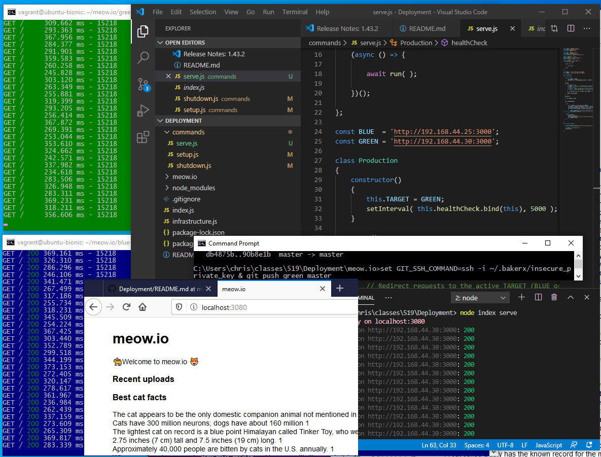

# Deployment

In this workshop, we'll cover the basics of setting up a barebone deployment pipeline, in support of a green-blue deployment strategy.

*TODO:* Diagram for pipeline.

### Blue-green deployment

Text about blue-green deployment.

## Workshop

### Before you start

To start with, you'll need some files in this repo to help setup the blue-green infrastructure.

    git clone https://github.com/CSC-DevOps/Deployment.git
    cd Deployment
    npm install
    # Setup two virtual machines
    node index setup

### Setting up our Pipeline

We will first setup a basic pipeline that will have two deployment endpoints for our application.

### Initializing our deployment endpoints.

We'll create two endpoints for our deployment, a "green" endpoint for our baseline, and a "blue" endpoint for our new production code.

Inside green, `bakerx ssh green`, run:

```bash
mkdir -p meow.io/green.git meow.io/green-www
cd meow.io/green.git
git init --bare
```

Inside blue, `bakerx ssh blue`, run:

```bash
mkdir -p meow.io/blue.git meow.io/blue-www
cd meow.io/blue.git
git init --bare
```

##### Post-Receive Hook

Like our pipelines workshop, we will use a bare repository and a hook script to receive and checkout changes pushed to our bare repository.

Inside green, `bakerx ssh green`, create a hook file:

```bash
cd meow.io/green.git/hooks/
touch post-receive
chmod +x post-receive
```

Place the following content inside:

    GIT_WORK_TREE=/home/vagrant/meow.io/green-www git checkout -f
    cd /home/vagrant/meow.io/green-www && npm install

Repeat for blue.

### Deploying Commits and Copying Bits

On your host computer, clone the [meow.io repo](https://github.com/CSC-DevOps/meow.io), and set the following remotes, using the ssh protocol:

    git clone https://github.com/CSC-DevOps/meow.io
    cd meow.io
    git remote add blue ssh://vagrant@192.168.44.25/home/vagrant/meow.io/blue.git
    git remote add green ssh://vagrant@192.168.44.30/home/vagrant/meow.io/green.git

You can now push changes in the following manner.

    GIT_SSH_COMMAND="ssh -i ~/.bakerx/insecure_private_key" git push green master
    GIT_SSH_COMMAND="ssh -i ~/.bakerx/insecure_private_key" git push blue master

Here, by setting `GIT_SSH_COMMAND`, we are telling git to use our ssh key for connecting to the VM. For Windows 🔽, you will need to modify the command to use `set`, followed by a `&`: `set GIT_SSH_COMMAND=ssh -i ~/.bakerx/insecure_private_key & git push green master`

### Testing deployment

We can go into our blue environment, `bakerx ssh blue`, and start our server:

```
cd meow.io/blue-www
# Create database
node data/init.js
# Start web server
npm start
```

Visit http://192.168.44.25:3000 in your browser to see if meow.io is running!

### Settting up Infrastructure




Currently, we can deploy changes to our VM, but 
Then bring up the infrastructure:
    node infrastructure
### Deploy a change.
Change the message to report, "Hello Blue".  
Push the change.

### Deploy a change.

Change the message to report, "Hello Blue".  

Push the change.

Test the blue server directly, using port 9090.

Notice, it hasn't updated yet...

You will need to modify how "forever" is run, by including a "--watch" flag which will restart the process if the file it is running changes.  Think carefully on where to place the flag.  You may also need to use "--watchDirectory" depending on where you have placed the deploy folders.

Push another change, "Hello Blue 2".  Now see if you can observe on the blue server.

### Add auto-switch over.


### Commit bad commit, trigger failover, revert bad change

Modify the index route, to explicitly fail: `res.status(500).render(...`

Have a heartbeat that checks every 5 seconds for a http 500, and if so, will switch the proxy over to the green environment.


```
$ git revert HEAD
[master 5edde92] Revert "bad commit"
 1 file changed, 1 insertion(+), 1 deletion(-)

$ git push green master
```

